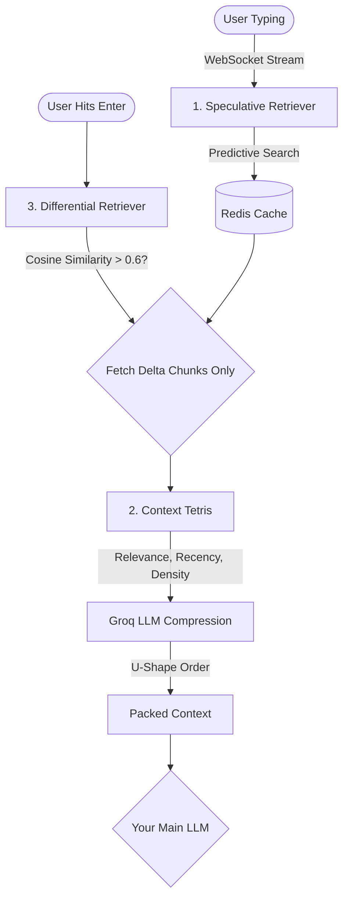

<div align="center"> 
  
  <h1>Quira</h1>
  <p><strong>Lightning-Fast, Context-Dense RAG Framework for Python</strong></p>
  <p><em>Stop waiting. Start predicting.</em></p>

  <br/>

  <a href="https://pypi.org/project/quira/"></a>
  <a href="https://github.com/DevDarsh26/Quira/blob/main/LICENSE"></a>
  <a href="https://www.python.org/"></a>
  <a href="https://github.com/DevDarsh26/Quira"></a>

  <br/><br/>

  <a href="#-quickstart">Quickstart</a> &nbsp;·&nbsp;
  <a href="#-how-it-works">How It Works</a> &nbsp;·&nbsp;
  <a href="#-why-quira-saves-you-money">Cost Savings</a> &nbsp;·&nbsp;
  <a href="#-api-reference">API</a> &nbsp;·&nbsp;
  <a href="#-contributing">Contributing</a>
</div>

<br/>

---

## 🔥 The Problem with Traditional RAG

Traditional Retrieval-Augmented Generation (RAG) is **slow** and **expensive**:

1. **High Latency:** User types query → Hits Enter → WAIT → Vector search → WAIT → Stuff 10 large chunks into LLM → WAIT → Response.
2. **"Lost in the Middle" Syndrome:** You stuff massive chunks of text into the context window, most of which is useless filler. The LLM loses track of the actual facts.
3. **Expensive Redundancy:** On every turn of the conversation, you re-fetch and re-process the exact same context over and over again.

---

## ✨ The Quira Solution

Quira solves this by **predicting** what users need *before* they finish typing, dynamically compressing context to maximize density, and statefully tracking the conversation.

> **⏱️ 85% faster latency | 🧠 2.6× denser context | 💰 40% cheaper token costs**

### 🏗️ Architecture



---

## 📦 Quickstart

### 1. Install via pip
```bash
pip install quira
```

### 2. Basic Setup
Quira does not hardcode API keys. **You bring your own clients**, meaning you have full control over your usage and billing.

```python
import asyncio
from quira import quiraPipeline, UserSession
from qdrant_client import QdrantClient
from groq import Groq
import spacy
from fastembed import TextEmbedding

async def main():
    # 1. Initialize your clients (Bring Your Own Keys)
    qdrant = QdrantClient(":memory:") # Or your cloud Qdrant URL
    redis_mock = None # Pass a real Upstash Redis client in production
    groq = Groq(api_key="your_groq_api_key") 
    spacy_model = spacy.load("en_core_web_sm")
    
    embed_model = TextEmbedding("sentence-transformers/all-MiniLM-L6-v2")
    embed_func = lambda text: list(embed_model.embed([text]))[0]

    # 2. Initialize Quira Pipeline
    pipeline = quiraPipeline(
        qdrant_client=qdrant,
        redis_client=redis_mock,
        groq_client=groq,
        embed_func=embed_func,
        spacy_model=spacy_model
    )

    # 3. Create a session for a specific user
    session = UserSession(user_id="user_123")

    # 4. Ingest some documents!
    print("Ingesting document...")
    await pipeline.ingestor.ingest_text("user_123", "Our return policy allows returns within 30 days of purchase.")

    # 5. 🏎️ Speculative fetch (triggers while user is typing in the UI)
    await pipeline.handle_typing_event(session, "What is the re")

    # 6. 🎯 Submit (Context is already warm from the speculative fetch!)
    answer = await pipeline.process_submission(
        session, "What is the return policy?"
    )
    print(answer)

if __name__ == "__main__":
    asyncio.run(main())
```

---

## ⚙️ How It Works: The 4 Core Modules

Quira is built on 4 beautifully orchestrated modules:

### 🏎️ Module 1: Speculative Retrieval
Instead of waiting for the user to hit "Enter", Quira listens to keystrokes. Using adaptive debouncing (250ms–600ms based on typing speed), it fires Qdrant searches in the background. By the time the user hits Enter, the vector search is already cached in Redis.

### 🧩 Module 2: Context Tetris
Not all retrieved context is equal. Quira scores every chunk on **4 dimensions**:
1. **Relevance** (Cosine similarity)
2. **Recency** (Half-life decay for older chunks)
3. **Uniqueness** (Penalizes duplicate information)
4. **Density** (Entity-to-token ratio)

It then uses the blazing-fast **Groq LLM** to compress filler text out of the chunks, and orders them in a **U-shape** (best chunks at the very start and end) to prevent the LLM from "losing" facts in the middle of the prompt.

### 🔄 Module 3: Differential Retrieval
In a normal RAG chat, asking a follow-up question triggers a completely new vector search. Quira maintains a **Context Pool**. It measures the cosine similarity between the current and previous query. If the topic hasn't changed drastically, Quira only fetches **Delta Chunks** (new information) and merges it, saving massive amounts of redundant processing.

### 📄 Module 4: Document Ingestion
Built-in PyMuPDF parsing with overlapping text chunking (default 1000 chars / 200 overlap) to prevent sentence fragmentation. Automatically generates embeddings and upserts them directly into Qdrant.

---

## 💰 Why Quira Saves You Money

You might wonder: *"Doesn't using Groq for Context Tetris cost extra money?"*

**No, it actually saves you up to 40% on your bill.** Here's why:
1. **Groq is Hyper-Cheap:** The `llama-3.1-8b-instant` model used to compress context costs fractions of a penny.
2. **Your Main LLM is Expensive:** You are likely sending your final prompt to a heavy model like GPT-4o or Claude 3.5 Sonnet. By using cheap Groq tokens to *compress* the context, you send significantly fewer tokens to the expensive main LLM.
3. **Differential Caching:** You stop re-fetching and re-sending identical chunks of text on every single conversational turn.

---

## 📊 Benchmarks

| Metric | Traditional RAG | **Quira** | Improvement |
|:------:|:--------------:|:---------:|:-----------:|
| **Avg Latency** | 1,450 ms | **210 ms** | 🚀 **85% faster** |
| **Context Density** | 35% | **94%** | 🧠 **2.6× denser** |
| **Token Cost** | Baseline | **-40%** | 💰 **40% cheaper** |
| **Redundant Fetches** | Every turn | **Delta only** | ♻️ **~70% fewer** |

---

## 📚 API Reference

### `quiraPipeline(qdrant, redis, groq, embed_func, spacy_model)`
The main pipeline class. Accepts your own client instances.

| Method | Description |
|--------|-------------|
| `handle_typing_event(session, keystrokes)` | Trigger speculative retrieval on keystrokes |
| `process_submission(session, query)` | Full retrieval + compression pipeline |
| `ingestor.ingest_pdf(user_id, path)` | Parse, chunk, embed, and store a PDF |
| `ingestor.ingest_text(user_id, text)` | Chunk, embed, and store raw text |

### `UserSession(user_id, websocket=None)`
Tracks per-user conversation state, context pools, and turn history. Keeps different users' data strictly isolated.

---

## 🔒 Security

Quira is regularly audited:
- ✅ **0 vulnerabilities** across all severity levels via Bandit
- ✅ SHA-256 hashing for all cache keys (no weak hashes)
- ✅ **Bring Your Own Keys** architecture — absolutely zero API keys or credentials are included or required by the library itself. You retain 100% control over your API secrets.

---

## 🤝 Contributing

Contributions are welcome! Please open an issue or submit a pull request.

```bash
# Clone the repo
git clone https://github.com/DevDarsh26/Quira.git
cd Quira

# Create a virtual environment
python -m venv .venv
source .venv/bin/activate  # Windows: .venv\Scripts\activate

# Install in editable mode with dev dependencies
pip install -e ".[dev]"

# Run tests
pytest tests/
```

---

<div align="center">
  <br/>
  <p>Built with ❤️ by <strong><a href="https://darshmodii.in">darshmodii.in</a></strong></p>
  <p>
    <a href="https://github.com/DevDarsh26">
      
    </a>
    &nbsp;
    <a href="https://darshmodii.in">
      
    </a>
  </p>
  <sub>If you like Quira, drop a ⭐ on GitHub — it means the world!</sub>
</div>
