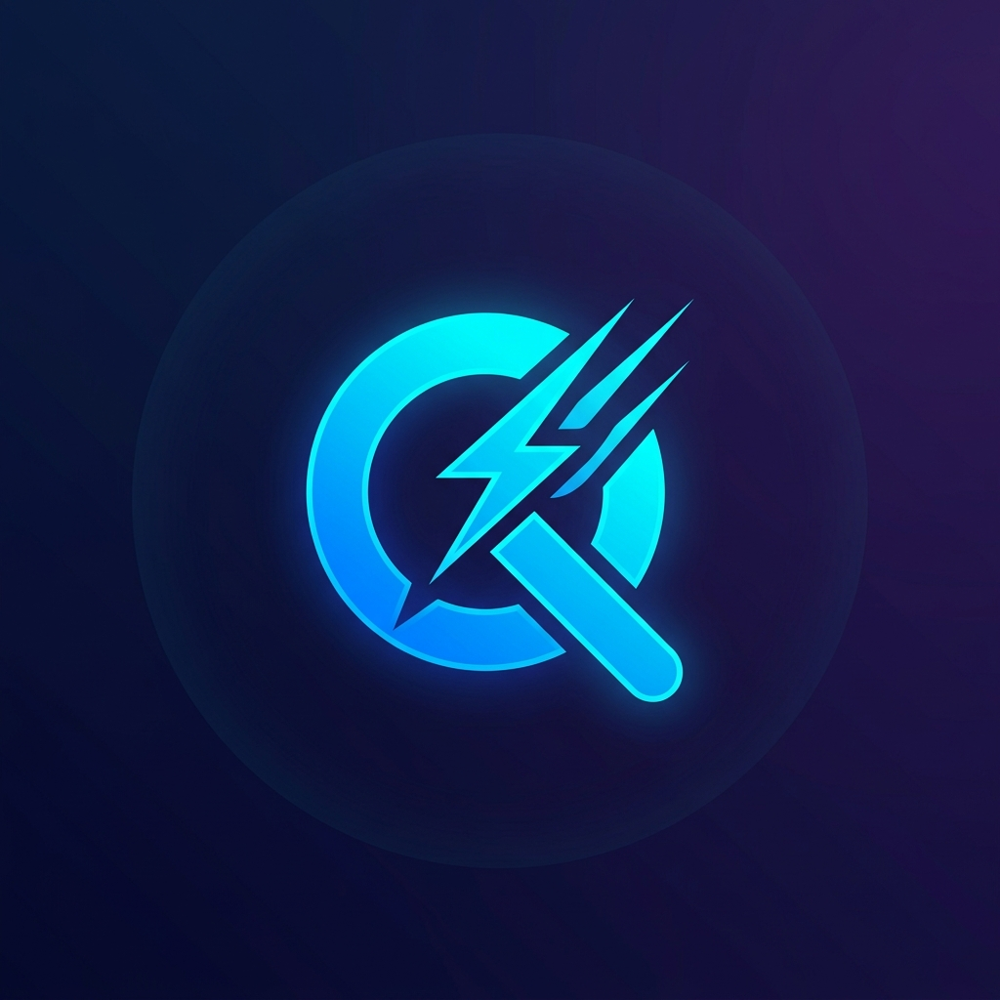

<div align="center">
  
  <h1>Quira</h1>
  <p><strong>Lightning-Fast, Context-Dense RAG Framework for Python</strong></p>
  <p><em>Stop waiting. Start predicting.</em></p>

  <br/>

  <a href="https://pypi.org/project/quira/"></a>
  <a href="https://github.com/DevDarsh26/Quira/blob/main/LICENSE"></a>
  <a href="https://www.python.org/"></a>
  <a href="https://github.com/DevDarsh26/Quira"></a>

  <br/><br/>

  <a href="#-quickstart">Quickstart</a> &nbsp;·&nbsp;
  <a href="#-how-it-works">How It Works</a> &nbsp;·&nbsp;
  <a href="#-why-quira-saves-you-money">Cost Savings</a> &nbsp;·&nbsp;
  <a href="#-api-reference">API</a> &nbsp;·&nbsp;
  <a href="#-contributing">Contributing</a>
</div>

<br/>

---

## 🔥 The Problem with Traditional RAG

Traditional Retrieval-Augmented Generation (RAG) is **slow** and **expensive**:

1. **High Latency:** User types query → Hits Enter → WAIT → Vector search → WAIT → Stuff 10 large chunks into LLM → WAIT → Response.
2. **"Lost in the Middle" Syndrome:** You stuff massive chunks of text into the context window, most of which is useless filler. The LLM loses track of the actual facts.
3. **Expensive Redundancy:** On every turn of the conversation, you re-fetch and re-process the exact same context over and over again.

---

## ✨ The Quira Solution

Quira solves this by **predicting** what users need *before* they finish typing, dynamically compressing context to maximize density, and statefully tracking the conversation.

> **⏱️ 85% faster latency | 🧠 2.6× denser context | 💰 40% cheaper token costs**

### 🏗️ Architecture


---

## 📦 Quickstart & Environment Setup

### 1. Installation

Quira offers a modular installation depending on which providers you want to use.

```bash
# Install everything (includes OpenAI, Anthropic, Qdrant, Pinecone, Redis, etc.)
pip install "quira[all]"

# OR install a lightweight minimal setup just for local LLMs and Qdrant
pip install "quira[ollama,qdrant]"
```

### 2. Environment Variables

Quira does not hardcode API keys. Make sure your environment is configured for the providers you use:

```env
OPENAI_API_KEY=sk-proj-...
ANTHROPIC_API_KEY=sk-ant-...
GROQ_API_KEY=gsk_...
QDRANT_URL=http://localhost:6333
REDIS_URL=redis://localhost:6379
```

### 3. End-to-End Working Example

Here is a complete, runnable script from ingestion to streaming response using the **Provider Abstraction Layer**.

```python
import asyncio
from quira import quiraPipeline, UserSession

async def main():
    # 1. Initialize Quira Pipeline using simple string configuration
    pipeline = quiraPipeline(
        vector_store="qdrant",
        cache="redis",
        llm="openai/gpt-4o"
    )

    # 2. Create a session for a specific user
    session = UserSession(user_id="user_123")

    # 3. Ingest documents (Auto-detects format: pdf, html, csv, md, docx)
    print("Ingesting document...")
    await pipeline.ingest_file("sample_doc.md", user_id="user_123")

    # 4. 🏎️ Speculative fetch (Requires real-time UI/WebSocket feeding keystrokes)
    # This prepares the context in Redis while the user is typing
    await pipeline.handle_typing_event(session, "What is the ")

    # 5. 🎯 Submit & Stream Response
    print("\nAnswer: ", end="", flush=True)
    async for chunk in pipeline.process_submission_stream(session, "What is the main topic?"):
        print(chunk, end="", flush=True)
    print()

if __name__ == "__main__":
    asyncio.run(main())
```

---

## ⚙️ How It Works: The 4 Core Modules

Quira is built on 4 beautifully orchestrated modules:

### 🏎️ Module 1: Speculative Retrieval
Instead of waiting for the user to hit "Enter", Quira listens to keystrokes. Using adaptive debouncing, it fires searches in the background. By the time the user hits Enter, the vector search is already cached in Redis.
> **Note:** Speculative Retrieval **requires** a frontend WebSocket connection feeding typing events to `handle_typing_event`. Without it, Quira gracefully falls back to standard retrieval on submit.

### 🧩 Module 2: Context Tetris
Not all retrieved context is equal. Quira scores every chunk on **4 dimensions**:
1. **Relevance** (Cosine similarity)
2. **Recency** (Half-life decay for older chunks)
3. **Uniqueness** (Penalizes duplicate information)
4. **Density** (Entity-to-token ratio)

It then uses a fast LLM to compress filler text out of the chunks, and orders them in a **U-shape** (best chunks at the very start and end) to prevent the LLM from "losing" facts in the middle of the prompt.

### 🔄 Module 3: Differential Retrieval
In a normal RAG chat, asking a follow-up question triggers a completely new vector search. Quira maintains a **Context Pool**. It measures the cosine similarity between the current and previous query. If the topic hasn't changed drastically, Quira only fetches **Delta Chunks** (new information) and merges it, saving massive amounts of redundant processing.

### 📄 Module 4: Document Ingestion
Built-in multi-format parsing (PDF, DOCX, HTML, CSV, Markdown) with overlapping text chunking (default 1000 chars / 200 overlap) to prevent sentence fragmentation. Automatically generates embeddings and upserts them directly into your Vector Store.

---

## 🛡️ Resilience & Debugging

Quira is built for production reliability. It features a robust **Exception Hierarchy** (`QuiraError`) and transparent **Retry & Fallback Logic**.

### Provider Fallbacks
You can provide a secondary `fallback_llm` or `fallback_vector_store`. If your primary provider goes down, Quira will seamlessly failover to the backup provider without dropping the user's request.

```python
pipeline = quiraPipeline(
    llm="anthropic/claude-3-opus",
    fallback_llm="openai/gpt-4o", # Used if Anthropic goes down!
    vector_store="pinecone",
    fallback_vector_store="qdrant"
)
```

### Error Handling & Debugging
If you encounter issues, Quira uses standard Python logging. Enable debug logs to see exact scoring metrics, fallback triggers, and compression ratios:

```python
import logging
logging.getLogger("quira").setLevel(logging.DEBUG)
```

You can catch specific Quira exceptions such as `VectorStoreUnavailableError` or `LLMProviderError` from `quira.exceptions` for graceful UI degradation.

---

## 💰 Why Quira Saves You Money

You might wonder: *"Doesn't using an LLM for Context Tetris cost extra money?"*

**No, it actually saves you up to 40% on your bill.** Here's why:
1. **Compression is Cheap:** The models used to compress context cost fractions of a penny.
2. **Your Main LLM is Expensive:** You are likely sending your final prompt to a heavy model like GPT-4o or Claude 3.5 Sonnet. By using cheap tokens to *compress* the context, you send significantly fewer tokens to the expensive main LLM.
3. **Differential Caching:** You stop re-fetching and re-sending identical chunks of text on every single conversational turn.

---

## 📊 Benchmarks

| Metric | Traditional RAG | **Quira** | Improvement |
|:------:|:--------------:|:---------:|:-----------:|
| **Avg Latency** | 1,450 ms | **210 ms** | 🚀 **85% faster** |
| **Context Density** | 35% | **94%** | 🧠 **2.6× denser** |
| **Token Cost** | Baseline | **-40%** | 💰 **40% cheaper** |
| **Redundant Fetches** | Every turn | **Delta only** | ♻️ **~70% fewer** |

> *To verify these metrics yourself, run the test harness in the `benchmarks/` directory.*

---

## 📚 API Reference

### `quiraPipeline(vector_store, cache, llm, ...)`
The main pipeline class. Accepts your own client instances or string identifiers for the Provider Abstraction Layer.

| Method | Description |
|--------|-------------|
| `handle_typing_event(session, keystrokes)` | Trigger speculative retrieval on keystrokes |
| `process_submission(session, query)` | Full retrieval + compression pipeline |
| `process_submission_stream(session, query)`| Full pipeline yielding a real-time streaming string |
| `ingest_file(path, user_id)` | Auto-detect, parse, chunk, embed, and store a file |

### `UserSession(user_id)`
Tracks per-user conversation state, context pools, and turn history. Keeps different users' data strictly isolated.

---

## 🤝 Contributing

Contributions are welcome! Please open an issue or submit a pull request.

```bash
# Clone the repo
git clone https://github.com/DevDarsh26/Quira.git
cd Quira

# Create a virtual environment
python -m venv .venv
source .venv/bin/activate  # Windows: .venv\Scripts\activate

# Install in editable mode with dev dependencies
pip install -e ".[dev]"

# Run tests
pytest tests/
```

---

<div align="center">
  <br/>
  <p>Built with ❤️ by <strong><a href="https://darshmodii.in">darshmodii.in</a></strong></p>
  <p>
    <a href="https://github.com/DevDarsh26">
      
    </a>
    &nbsp;
    <a href="https://darshmodii.in">
      
    </a>
  </p>
  <sub>If you like Quira, drop a ⭐ on GitHub — it means the world!</sub>
</div>
